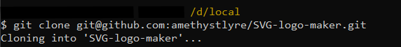
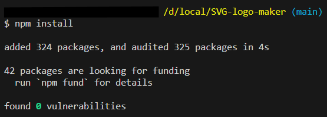
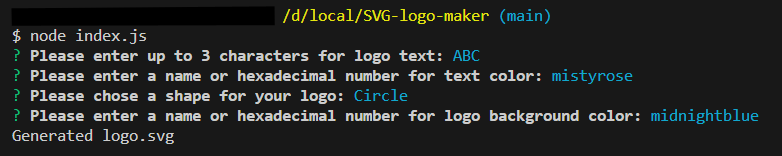

# SVG logo maker

## Description
    
This tool helps users quickly generate simple logo files saved in SVG file format by using a command-line application.
    
## Table of Contents
    
- [Installation](#installation)
- [Usage](#usage)
- [Credits](#credits)
- [License](#license)
- [How to Contribute](#how-to-contribute)
- [Tests](#tests)
- [Questions](#questions)
    
## Installation
    
1.Clone this Git repo to your local directory. 
 
2.Open the repo folder in VS Studio or your preferred code editor. 
3.Open the Integrated Terminal and enter command `npm install` to download the required Inquirer package. 

## Usage
    
Once the dependencies have been installed, you can invoke the application with command `node index.js` in the terminal. Follow the prompts to answer each question. The logo will be generated based on the user's input and saved as a SVG file, located under the "output" directory. For more detailed instructions, please watch the [walkthrough video](https://drive.google.com/file/d/15axoL5OmgDoXH9Jhs69r2NgD764oSSnD/view?usp=sharing). 

The above commandline input will generate a SVG file that looks like image below: 

    
## Credits
Colors are validated using third party package [Validate Color](https://www.npmjs.com/package/validate-color). 
Special characters are escaped using third party package [escape-html](https://www.npmjs.com/package/escape-html).

## License
 
This project is licensed under the MIT License - see the [LICENSE.md](license) file for details    
 
## How to Contribute
    
Feel free to contribute your ideas or bug fixes for this project by raising a new issue or new pull request.
    
## Tests
    
Tests are written using Jest module and are saved under the "tests" directory. These can be run using `npm run test` command in the terminal.
